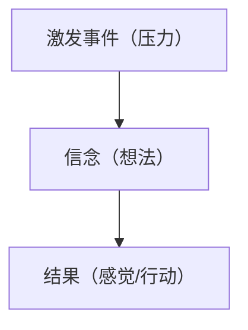

# 1%法则

> 汤姆·麻兰

对于运动员来说，恢复通常意味着做一些放松的事情。
但是对于工作不是很耗费体力的人来说，运动是最好的休息方式

涟漪效应：

如果你开心，你的邻居开心的可能性会提高 34%。

1. 一英里内的兄弟姐妹们提升 14%
2. 一英里内的朋友们提升 25%
3. 朋友的朋友提升 10%
4. 朋友的朋友的朋友提升 5.6%

“我还未成为百万富翁”

如果思想能够改变身体，那么身体也能够改变思想

3 周 × 20 分钟的自由投篮，水平提升 24%
3 周 × 20 分钟的想象投篮，水平提升 23%
